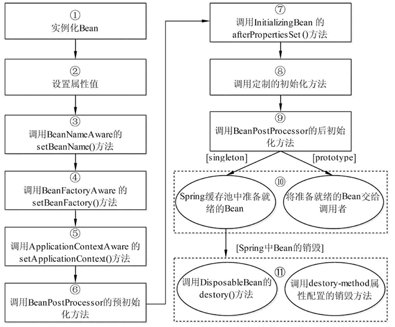

#Spring Bean
##Bean 定义
被称作 bean 的对象是构成应用程序的支柱也是由 Spring IoC 容器管理的。  
bean 是一个被实例化，组装，并通过 Spring IoC 容器所管理的对象。  
这些 bean 是由用容器提供的配置元数据创建的。  
bean 定义包含称为*配置元数据*的信息，下述容器也需要知道配置元数据：：  
 * 如何创建一个 bean
 * bean 的生命周期的详细信息
 * bean 的依赖关系  

上述所有的配置元数据转换成一组构成每个 bean 定义的下列属性。
\<bean>元素的常用属性  

 | 属性名称 | 描述
 | ---- | ----
 | id | 是一个 Bean 的唯一标识符，Spring 容器对 Bean 的配置和管理都通过该属性完成
 | name | Spring 容器同样可以通过此属性对容器中的 Bean 进行配置和管理，name 属性中可以为 Bean 指定多个名称，每个名称之间用逗号或分号隔开
 | class | 该属性指定了 Bean 的具体实现类，它必须是一个完整的类名，使用类的全限定名
 | scope | 用于设定 Bean 实例的作用域，其属性值有 singleton（单例）、prototype（原型）、request、session 和 global Session。其默认值是 singleton
 | constructor-arg | \<bean>元素的子元素，可以使用此元素传入构造参数进行实例化。该元素的 index 属性指定构造参数的序号（从 0 开始），type 属性指定构造参数的类型
 | property | \<bean>元素的子元素，用于调用 Bean 实例中的 Set 方法完成属性赋值，从而完成依赖注入。该元素的 name 属性指定 Bean 实例中的相应属性名
 | ref | \<property> 和 \<constructor-arg> 等元素的子元索，该元素中的 bean 属性用于指定对 Bean 工厂中某个 Bean 实例的引用
 | value | \<property> 和 \<constractor-arg> 等元素的子元素，用于直接指定一个常量值
 | list | 用于封装 List 或数组类型的依赖注入
 | set | 用于封装 Set 类型属性的依赖注入
 | map | 用于封装 Map 类型属性的依赖注入
 | entry | \<map> 元素的子元素，用于设置一个键值对。其 key 属性指定字符串类型的键值，ref 或 value 子元素指定其值

##Bean 与 Spring 容器的关系
下图表达了Bean 与 Spring 容器之间的关系：

##Spring 配置元数据
Spring IoC 容器完全由实际编写的配置元数据的格式解耦。有下面三个重要的方法把配置元数据提供给 Spring 容器：
 * 基于 XML 的配置文件
 * 基于 注解 的配置
 * 基于 Java 的配置  

##Bean 的作用域
当在 Spring 中定义一个 bean 时，你必须声明该 bean 的作用域的选项。  
例如，为了强制 Spring 在每次需要时都产生一个新的 bean 实例，你应该声明 bean 的作用域的属性为 prototype。  
同理，如果你想让 Spring 在每次需要时都返回同一个bean实例，你应该声明 bean 的作用域的属性为 singleton。  
Spring 框架支持以下五个作用域，分别为singleton、prototype、request、session和global-session,5种作用域说明如下所示;  
注意，如果你使用 web-aware ApplicationContext 时，其中三个是可用的。  

 | 作用域 | 描述
 | ---- | ----
 | singleton | 在spring IoC容器仅存在一个Bean实例，Bean以单例方式存在，默认值
 | prototype | 每次从容器中调用Bean时，都返回一个新的实例，即每次调用getBean()时，相当于执行newXxxBean()
 | request | 每次HTTP请求都会创建一个新的Bean，该作用域仅适用于WebApplicationContext环境
 | session | 同一个HTTP Session共享一个Bean，不同Session使用不同的Bean，仅适用于WebApplicationContext环境
 | global-session | 一般用于Portlet应用环境，该运用域仅适用于WebApplicationContext环境  
 
 ###singleton 作用域
singleton 是默认的作用域，也就是说，当定义 Bean 时，如果没有指定作用域配置项，则 Bean 的作用域被默认为 singleton。  
当一个bean的作用域为Singleton，那么Spring IoC容器中只会存在一个共享的bean实例，并且所有对bean的请求，只要id与该bean定义相匹配，则只会返回bean的同一实例。  
也就是说，当将一个bean定义设置为singleton作用域的时候，Spring IoC容器只会创建该bean定义的唯一实例。  
Singleton是单例类型，就是在创建起容器时就同时自动创建了一个bean的对象，不管你是否使用，他都存在了，每次获取到的对象都是同一个对象。注意，Singleton作用域是Spring中的缺省作用域.  

###prototype 作用域
当一个bean的作用域为Prototype，表示一个bean定义对应多个对象实例。  
Prototype作用域的bean会导致在每次对该bean请求（将其注入到另一个bean中，或者以程序的方式调用容器的getBean()方法）时都会创建一个新的bean实例。  
Prototype是原型类型，它在我们创建容器的时候并没有实例化，而是当我们获取bean的时候才会去创建一个对象，而且我们每次获取到的对象都不是同一个对象。  
根据经验，对有状态的bean应该使用prototype作用域，而对无状态的bean则应该使用singleton作用域。

##Bean 的生命周期
理解 Spring bean 的生命周期很容易。当一个 bean 被实例化时，它可能需要执行一些初始化使它转换成可用状态。同样，当 bean 不再需要，并且从容器中移除时，可能需要做一些清除工作。  
尽管还有一些在 Bean 实例化和销毁之间发生的活动，但是我只实现两个重要的生命周期回调方法，它们在 bean 的初始化和销毁的时候是必需的。  
为了定义安装和拆卸一个 bean，我们只要声明带有 init-method 和/或 destroy-method 参数的 。  
init-method 属性指定一个方法，在实例化 bean 时，立即调用该方法。同样，destroy-method 指定一个方法，只有从容器中移除 bean 之后，才能调用该方法。  
Bean的生命周期可以表达为：Bean的定义——Bean的初始化——Bean的使用——Bean的销毁。

Bean 生命周期图：

Bean 生命周期的整个执行过程描述如下。

1）根据配置情况调用 Bean 构造方法或工厂方法实例化 Bean。

2）利用依赖注入完成 Bean 中所有属性值的配置注入。

3）如果 Bean 实现了 BeanNameAware 接口，则 Spring 调用 Bean 的 setBeanName() 方法传入当前 Bean 的 id 值。

4）如果 Bean 实现了 BeanFactoryAware 接口，则 Spring 调用 setBeanFactory() 方法传入当前工厂实例的引用。

5）如果 Bean 实现了 ApplicationContextAware 接口，则 Spring 调用 setApplicationContext() 方法传入当前 ApplicationContext 实例的引用。

6）如果 BeanPostProcessor 和 Bean 关联，则 Spring 将调用该接口的预初始化方法 postProcessBeforeInitialzation() 对 Bean 进行加工操作，此处非常重要，Spring 的 AOP 就是利用它实现的。

7）如果 Bean 实现了 InitializingBean 接口，则 Spring 将调用 afterPropertiesSet() 方法。

8）如果在配置文件中通过 init-method 属性指定了初始化方法，则调用该初始化方法。

9）如果 BeanPostProcessor 和 Bean 关联，则 Spring 将调用该接口的初始化方法 postProcessAfterInitialization()。此时，Bean 已经可以被应用系统使用了。

10）如果在 <bean> 中指定了该 Bean 的作用范围为 scope="singleton"，则将该 Bean 放入 Spring IoC 的缓存池中，将触发 Spring 对该 Bean 的生命周期管理；如果在 <bean> 中指定了该 Bean 的作用范围为 scope="prototype"，则将该 Bean 交给调用者，调用者管理该 Bean 的生命周期，Spring 不再管理该 Bean。

11）如果 Bean 实现了 DisposableBean 接口，则 Spring 会调用 destory() 方法将 Spring 中的 Bean 销毁；如果在配置文件中通过 destory-method 属性指定了 Bean 的销毁方法，则 Spring 将调用该方法对 Bean 进行销毁。

Spring 为 Bean 提供了细致全面的生命周期过程，通过实现特定的接口或 <bean> 的属性设置，都可以对 Bean 的生命周期过程产生影响。虽然可以随意配置 <bean> 的属性，但是建议不要过多地使用 Bean 实现接口，因为这样会导致代码和 Spring 的聚合过于紧密。

##Bean 后置处理器
Bean 后置处理器允许在调用初始化方法前后对 Bean 进行额外的处理。  
BeanPostProcessor 接口定义回调方法，你可以实现该方法来提供自己的实例化逻辑，依赖解析逻辑等。  
你也可以在 Spring 容器通过插入一个或多个 BeanPostProcessor 的实现来完成实例化，配置和初始化一个bean之后实现一些自定义逻辑回调方法。  
你可以配置多个 BeanPostProcessor 接口，通过设置 BeanPostProcessor 实现的 Ordered 接口提供的 order 属性来控制这些 BeanPostProcessor 接口的执行顺序。
BeanPostProcessor 可以对 bean（或对象）实例进行操作，这意味着 Spring IoC 容器实例化一个 bean 实例，然后 BeanPostProcessor 接口进行它们的工作。  
ApplicationContext 会自动检测由 BeanPostProcessor 接口的实现定义的 bean，注册这些 bean 为后置处理器，然后通过在容器中创建 bean，在适当的时候调用它。  

#装配bean的三种方式  

##基于 xml 装配bean  
'''

    <bean id="class" class="com.jiaxc.dao.Class" >
        <property name="className" value="五年二班" />
    </bean>

    <bean id="student" class="com.jiaxc.dao.Student" >
        <property name="studentName" value="张三" />
        <property name="myClass" ref="class" />
    </bean>

'''
##基于 注解 装配bean  
尽管使用 XML 配置文件可以实现 Bean 的装配工作，但如果应用中 Bean 的数量较多，会导致 XML 配置文件过于臃肿，从而给维护和升级带来一定的困难。  
你可以使用相关类，方法或字段声明的注解，将 bean 配置移动到组件类本身。  
注解连线在默认情况下在 Spring 容器中不打开。因此，在可以使用基于注解的连线之前，我们将需要在我们的 Spring 配置文件中启用它。  
'''

    <context:annotation-config/>

'''  
常用注解：  
1）@Component  
可以使用此注解描述 Spring 中的 Bean，但它是一个泛化的概念，仅仅表示一个组件（Bean），并且可以作用在任何层次。使用时只需将该注解标注在相应类上即可。  
2）@Repository  
用于将数据访问层（DAO层）的类标识为 Spring 中的 Bean，其功能与 @Component 相同。  
3）@Service  
通常作用在业务层（Service 层），用于将业务层的类标识为 Spring 中的 Bean，其功能与 @Component 相同。  
4）@Controller  
通常作用在控制层（如 Struts2 的 Action），用于将控制层的类标识为 Spring 中的 Bean，其功能与 @Component 相同。  
5）@Autowired  
用于对 Bean 的属性变量、属性的 Set 方法及构造函数进行标注，配合对应的注解处理器完成 Bean 的自动配置工作。默认按照 Bean 的类型进行装配。  
6）@Resource
其作用与 Autowired 一样。其区别在于 @Autowired 默认按照 Bean 类型装配，而 @Resource 默认按照 Bean 实例名称进行装配。  
@Resource 中有两个重要属性：name 和 type。  
Spring 将 name 属性解析为 Bean 实例名称，type 属性解析为 Bean 实例类型。如果指定 name 属性，则按实例名称进行装配；如果指定 type 属性，则按 Bean 类型进行装配。    
如果都不指定，则先按 Bean 实例名称装配，如果不能匹配，则再按照 Bean 类型进行装配；如果都无法匹配，则抛出 NoSuchBeanDefinitionException 异常。  
7）@Qualifier  
与 @Autowired 注解配合使用，会将默认的按 Bean 类型装配修改为按 Bean 的实例名称装配，Bean 的实例名称由 @Qualifier 注解的参数指定。  
8）@Required  
@Required 注释应用于 bean 属性的 setter 方法，它表明受影响的 bean 属性在配置时必须放在 XML 配置文件中，否则容器就会抛出一个 BeanInitializationException 异常。  
9）@Autowired  
@Autowired 注解可以应用到 bean 属性的 setter 方法，非 setter 方法，构造函数和属性。它对在哪里和如何完成自动连接提供了更多的细微的控制。  
当时使用 为自动连接属性传递的时候，Spring 会将这些传递过来的值或者引用自动分配给那些属性;  
当 Spring遇到一个在 setter 方法中使用的 @Autowired 注释，它会在方法中视图执行 byType 自动连接;  
一个构造函数 @Autowired 说明当创建 bean 时，即使在 XML 文件中没有使用 元素配置 bean ，构造函数也会被自动连接;  
默认情况下，@Autowired 注释意味着依赖是必须的，它类似于 @Required 注释，然而，你可以使用 @Autowired 的 （required=false） 选项关闭默认行为。  
10）@Qualifier  
通过指定确切的将被连线的 bean，@Autowired 和 @Qualifier 注解可以用来删除混乱。  
可能会有这样一种情况，当你创建多个具有相同类型的 bean 时，并且想要用一个属性只为它们其中的一个进行装配，在这种情况下，你可以使用 @Qualifier 注释和 @Autowired 注释通过指定哪一个真正的 bean 将会被装配来消除混乱。
11）JSR-250 Annotations  
Spring 支持 JSR-250 的基础的注解，其中包括了 @Resource，@PostConstruct 和 @PreDestroy 注解。  
@PostConstruct 和 @PreDestroy 注释：  
为了定义一个 bean 的安装和卸载，我们使用 init-method 和/或 destroy-method 参数简单的声明一下 。init-method 属性指定了一个方法，该方法在 bean 的实例化阶段会立即被调用。同样地，destroy-method 指定了一个方法，该方法只在一个 bean 从容器中删除之前被调用。  
你可以使用 @PostConstruct 注释作为初始化回调函数的一个替代，@PreDestroy 注释作为销毁回调函数的一个替代，其解释如下示例所示。  
@Resource 注释：  
你可以在字段中或者 setter 方法中使用 @Resource 注释，它和在 Java EE 5 中的运作是一样的。@Resource 注释使用一个 ‘name’ 属性，该属性以一个 bean 名称的形式被注入。你可以说，它遵循 by-name 自动连接语义.  
如果没有明确地指定一个 ‘name’，默认名称源于字段名或者 setter 方法。在字段的情况下，它使用的是字段名；在一个 setter 方法情况下，它使用的是 bean 属性名称。  

##自动装配bean  
可以使用<bean>元素的 autowire 属性为一个 bean 定义指定自动装配模式。  

 | 模式 | 描述
 | :----: | ----
 | no | 这是默认的设置，它意味着没有自动装配，你应该使用显式的bean引用来连线。你不用为了连线做特殊的事。在依赖注入章节你已经看到这个了。
 | byName | 由属性名自动装配。Spring 容器看到在 XML 配置文件中 bean 的自动装配的属性设置为 byName。然后尝试匹配，并且将它的属性与在配置文件中被定义为相同名称的 beans 的属性进行连接。
 | byType | 由属性数据类型自动装配。Spring 容器看到在 XML 配置文件中 bean 的自动装配的属性设置为 byType。然后如果它的类型匹配配置文件中的一个确切的 bean 名称，它将尝试匹配和连接属性的类型。如果存在不止一个这样的 bean，则一个致命的异常将会被抛出。
 | constructor | 类似于 byType，但该类型适用于构造函数参数类型。如果在容器中没有一个构造函数参数类型的 bean，则一个致命错误将会发生。
 | autodetect | Spring首先尝试通过 constructor 使用自动装配来连接，如果它不执行，Spring 尝试通过 byType 来自动装配。

可以使用 byType 或者 constructor 自动装配模式来连接数组和其他类型的集合。  

###自动装配的局限性
当自动装配始终在同一个项目中使用时，它的效果最好。如果通常不使用自动装配，它可能会使开发人员混淆的使用它来连接只有一个或两个 bean 定义。不过，自动装配可以显著减少需要指定的属性或构造器参数，但你应该在使用它们之前考虑到自动装配的局限性和缺点。  

 | 限制 | 描述
 | :----: | ----
 | 重写的可能性 | 你可以使用总是重写自动装配的 <constructor-arg>和 <property> 设置来指定依赖关系。
 | 原始数据类型 | 你不能自动装配所谓的简单类型包括基本类型，字符串和类。
 | 混乱的本质 | 自动装配不如显式装配精确，所以如果可能的话尽可能使用显式装配。
 
###Spring 自动装配 ‘byName’
这种模式由属性名称指定自动装配。Spring 容器看作 beans，在 XML 配置文件中 beans 的 auto-wire 属性设置为 byName。然后，它尝试将它的属性与配置文件中定义为相同名称的 beans 进行匹配和连接。如果找到匹配项，它将注入这些 beans，否则，它将抛出异常。  
例如，在配置文件中，如果一个 bean 定义设置为自动装配 byName，并且它包含 spellChecker 属性（即，它有一个 setSpellChecker(...) 方法），那么 Spring 就会查找定义名为 spellChecker 的 bean，并且用它来设置这个属性。你仍然可以使用 <property> 标签连接其余的属性。  

###Spring 自动装配 ‘byType’
这种模式由属性类型指定自动装配。Spring 容器看作 beans，在 XML 配置文件中 beans 的 autowire 属性设置为 byType。然后，如果它的 type 恰好与配置文件中 beans 名称中的一个相匹配，它将尝试匹配和连接它的属性。如果找到匹配项，它将注入这些 beans，否则，它将抛出异常。  
例如，在配置文件中，如果一个 bean 定义设置为自动装配 byType，并且它包含 SpellChecker 类型的 spellChecker 属性，那么 Spring 就会查找定义名为 SpellChecker 的 bean，并且用它来设置这个属性。你仍然可以使用 <property> 标签连接其余属性.  

###Spring 由构造函数自动装配
这种模式与 byType 非常相似，但它应用于构造器参数。Spring 容器看作 beans，在 XML 配置文件中 beans 的 autowire 属性设置为 constructor。然后，它尝试把它的构造函数的参数与配置文件中 beans 名称中的一个进行匹配和连线。如果找到匹配项，它会注入这些 bean，否则，它会抛出异常。  
例如，在配置文件中，如果一个 bean 定义设置为通过构造函数自动装配，而且它有一个带有 SpellChecker 类型的参数之一的构造函数，那么 Spring 就会查找定义名为 SpellChecker 的 bean，并用它来设置构造函数的参数。你仍然可以使用 <constructor-arg> 标签连接其余属性。  